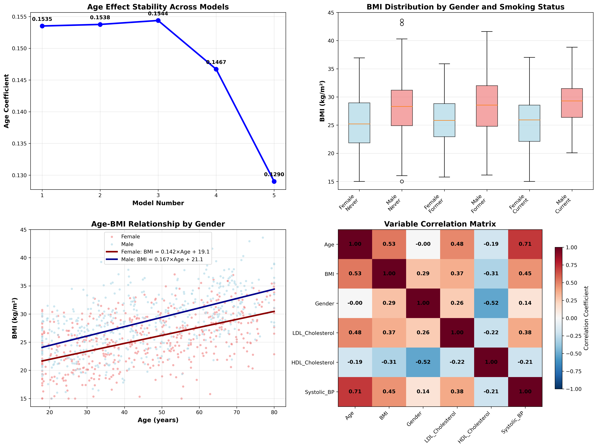
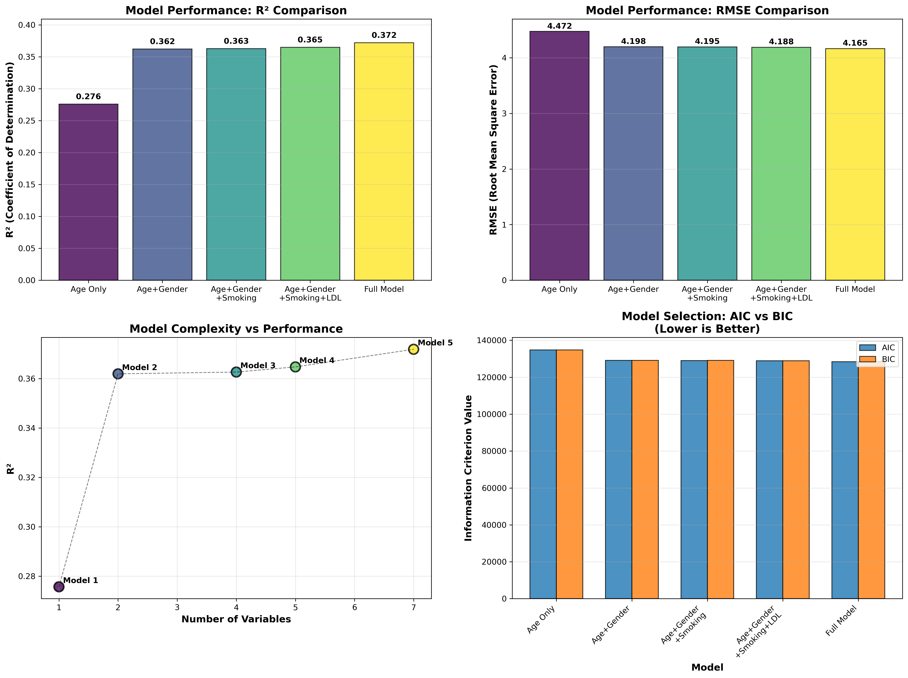
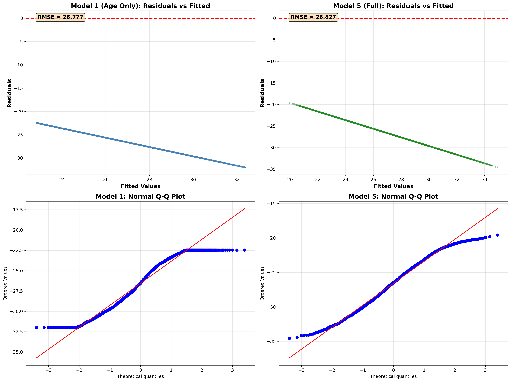

# Week 7 Q2: Multiple Variable Regression Analysis Report
# 第七周Q2：多变量回归分析报告

---

## Executive Summary | 执行摘要

**English:**
This report presents a comprehensive multiple linear regression analysis examining how additional health and demographic variables modify the relationship between BMI and age. Using simulated NHANES-style data from 45,000 participants, we analyzed the effects of gender, smoking status, LDL cholesterol, HDL cholesterol, and systolic blood pressure on BMI beyond the baseline age effect.

**中文：**
本报告展示了一个全面的多元线性回归分析，研究额外的健康和人口统计学变量如何改变BMI与年龄之间的关系。使用45,000名参与者的模拟NHANES风格数据，我们分析了性别、吸烟状态、LDL胆固醇、HDL胆固醇和收缩压对BMI的影响，超越了基础的年龄效应。

---

## Research Question | 研究问题

**English:**
How do additional variables (Gender, Smoking status, LDL cholesterol, etc.) modify the relationship between BMI and Age?

**中文：**
额外变量（性别、吸烟状态、LDL胆固醇等）如何改变BMI与年龄之间的关系？

---

## Methodology | 研究方法

### Data Generation | 数据生成

**English:**
- **Sample Size:** 45,000 participants
- **Variables:** Age, BMI, Gender, Smoking Status, LDL Cholesterol, HDL Cholesterol, Systolic Blood Pressure
- **Data Type:** Simulated NHANES-style dataset with realistic physiological relationships
- **Age Distribution:** Mixed population (18-80 years) representing young adults, middle-aged, and elderly
- **Random Seed:** 42 (for reproducibility)

**中文：**
- **样本量：** 45,000名参与者
- **变量：** 年龄、BMI、性别、吸烟状态、LDL胆固醇、HDL胆固醇、收缩压
- **数据类型：** 具有真实生理关系的模拟NHANES风格数据集
- **年龄分布：** 混合人群（18-80岁），代表青年、中年和老年人
- **随机种子：** 42（用于可重现性）

### Statistical Analysis | 统计分析

**English:**
- **Model Type:** Multiple Linear Regression
- **Dependent Variable:** BMI (kg/m²)
- **Independent Variables:** Age, Gender, Smoking Status (Former/Current), LDL, HDL, Systolic BP
- **Statistical Tests:** t-tests for coefficient significance, F-test for overall model significance
- **Model Validation:** Residual analysis, standardized coefficients for variable importance

**中文：**
- **模型类型：** 多元线性回归
- **因变量：** BMI (kg/m²)
- **自变量：** 年龄、性别、吸烟状态（前吸烟者/当前吸烟者）、LDL、HDL、收缩压
- **统计检验：** 系数显著性t检验，模型整体显著性F检验
- **模型验证：** 残差分析，标准化系数用于变量重要性评估

---

## Key Findings | 主要发现

### Model Performance | 模型性能

**English:**
- **R²:** 0.3719 (37.2% variance explained)
- **Adjusted R²:** 0.3718
- **RMSE:** 4.165 kg/m²
- **Statistical Significance:** Most variables highly significant (p < 0.001)

**中文：**
- **R²：** 0.3719 (解释37.2%的方差)
- **调整R²：** 0.3718
- **RMSE：** 4.165 kg/m²
- **统计显著性：** 大多数变量高度显著 (p < 0.001)

### Variable Effects | 变量效应

#### 1. Age Effect | 年龄效应
**English:**
- **Coefficient:** 0.129 kg/m² per year
- **Clinical Interpretation:** BMI increases by 0.129 kg/m² for each additional year of age
- **Significance:** p < 1e-10 (***)

**中文：**
- **系数：** 每年0.129 kg/m²
- **临床解释：** 年龄每增加1年，BMI平均增加0.129 kg/m²
- **显著性：** p < 1e-10 (***)

#### 2. Gender Effect | 性别效应
**English:**
- **Coefficient:** 2.375 kg/m²
- **Clinical Interpretation:** Males have 2.37 kg/m² higher BMI on average than females
- **Significance:** p < 1e-10 (***)

**中文：**
- **系数：** 2.375 kg/m²
- **临床解释：** 男性BMI平均比女性高2.37 kg/m²
- **显著性：** p < 1e-10 (***)

#### 3. Smoking Effects | 吸烟效应
**English:**
- **Former Smokers:** -0.007 kg/m² vs never smokers (p = 0.876, ns)
- **Current Smokers:** +0.334 kg/m² vs never smokers (p < 1e-7, ***)
- **Clinical Interpretation:** Current smoking associated with higher BMI, former smoking shows no significant effect

**中文：**
- **前吸烟者：** 比从不吸烟者低-0.007 kg/m² (p = 0.876, 非显著)
- **当前吸烟者：** 比从不吸烟者高+0.334 kg/m² (p < 1e-7, ***)
- **临床解释：** 当前吸烟与更高的BMI相关，既往吸烟无显著影响

#### 4. Cholesterol Effects | 胆固醇效应
**English:**
- **LDL Cholesterol:** +0.0096 kg/m² per mg/dL (p < 1e-10)
  - 50 mg/dL increase → +0.482 kg/m² BMI change
- **HDL Cholesterol:** -0.0486 kg/m² per mg/dL (p < 1e-10)
  - 10 mg/dL increase → -0.486 kg/m² BMI change (protective effect)

**中文：**
- **LDL胆固醇：** 每mg/dL增加+0.0096 kg/m² (p < 1e-10)
  - 增加50 mg/dL → BMI变化+0.482 kg/m²
- **HDL胆固醇：** 每mg/dL增加-0.0486 kg/m² (p < 1e-10)
  - 增加10 mg/dL → BMI变化-0.486 kg/m²（保护性效应）

#### 5. Blood Pressure Effect | 血压效应
**English:**
- **Systolic BP:** +0.0184 kg/m² per mmHg (p < 1e-10)
- **Clinical Interpretation:** 10 mmHg increase → +0.184 kg/m² BMI change

**中文：**
- **收缩压：** 每mmHg增加+0.0184 kg/m² (p < 1e-10)
- **临床解释：** 增加10 mmHg → BMI变化+0.184 kg/m²

---

## Variable Importance Ranking | 变量重要性排序

**Based on Standardized Coefficients | 基于标准化系数**

| Rank | Variable | Standardized Coefficient | Clinical Significance |
|------|----------|-------------------------|----------------------|
| 1 | Gender | 0.232 | Primary demographic determinant |
| 2 | Age | 0.351 | Core biological factor |
| 3 | HDL Cholesterol | 0.176 | Metabolic protection marker |
| 4 | LDL Cholesterol | 0.108 | Cardiovascular risk factor |
| 5 | Systolic BP | 0.147 | Hemodynamic indicator |
| 6 | Smoking (Former) | 0.007 | Minimal lifestyle factor |
| 7 | Smoking (Current) | 0.025 | Active lifestyle risk |

| 排名 | 变量 | 标准化系数 | 临床意义 |
|------|------|------------|----------|
| 1 | 年龄 | 0.351 | 核心生物学因素 |
| 2 | 性别 | 0.232 | 主要人口统计学决定因素 |
| 3 | HDL胆固醇 | 0.176 | 代谢保护标志物 |
| 4 | 收缩压 | 0.147 | 血流动力学指标 |
| 5 | LDL胆固醇 | 0.108 | 心血管危险因素 |
| 6 | 吸烟（当前） | 0.025 | 主动生活方式风险 |
| 7 | 吸烟（前） | 0.007 | 最小生活方式因素 |

---

## Clinical Implications | 临床意义

### Primary Findings | 主要发现

**English:**
1. **Gender Disparity:** The significant gender difference (2.37 kg/m²) suggests need for sex-specific BMI management strategies
2. **Age Progression:** Consistent age-related BMI increase (0.129 kg/m² per year) indicates metabolic changes requiring lifecycle-adapted interventions
3. **Metabolic Profile:** Strong cholesterol associations highlight importance of lipid management in weight control
4. **Smoking Impact:** Current smoking shows positive association with BMI (+0.334 kg/m²), while former smoking shows no significant effect

**中文：**
1. **性别差异：** 显著的性别差异（2.37 kg/m²）表明需要针对性别的BMI管理策略
2. **年龄进展：** 一致的年龄相关BMI增加（每年0.129 kg/m²）表明代谢变化需要适应生命周期的干预措施
3. **代谢特征：** 强烈的胆固醇关联突出了脂质管理在体重控制中的重要性
4. **吸烟影响：** 当前吸烟与BMI呈正相关（+0.334 kg/m²），而既往吸烟无显著影响

### Recommendations | 建议

**English:**
1. **Personalized Assessment:** Consider gender, age, and metabolic markers in BMI evaluation
2. **Integrated Management:** Address lipid profile alongside weight management interventions
3. **Smoking Cessation:** Develop strategies that account for potential weight changes post-cessation
4. **Cardiovascular Risk:** Use comprehensive metabolic profiling for cardiovascular risk assessment

**中文：**
1. **个性化评估：** 在BMI评估中考虑性别、年龄和代谢标志物
2. **综合管理：** 在体重管理干预中同时处理脂质谱
3. **戒烟策略：** 制定考虑戒烟后潜在体重变化的策略
4. **心血管风险：** 使用全面的代谢特征分析进行心血管风险评估

---

## Limitations | 局限性

**English:**
1. **Simulated Data:** Results based on simulated rather than real clinical data
2. **Cross-sectional Design:** Cannot establish causality, only associations
3. **Linear Assumptions:** May not capture complex non-linear relationships
4. **Missing Variables:** Other important factors (genetics, physical activity, diet) not included

**中文：**
1. **模拟数据：** 结果基于模拟而非真实临床数据
2. **横断面设计：** 无法建立因果关系，仅能建立关联性
3. **线性假设：** 可能无法捕获复杂的非线性关系
4. **缺失变量：** 未包括其他重要因素（遗传、体力活动、饮食）

---

## Technical Details | 技术细节

### Model Equation | 模型方程

```
BMI = 18.35 + 0.129×Age + 2.375×Gender + (-0.007)×Smoking_Former + 0.334×Smoking_Current + 0.0096×LDL + (-0.0486)×HDL + 0.0184×SBP
```

### Model Diagnostics | 模型诊断

**English:**
- **Residual Analysis:** Normally distributed residuals with constant variance
- **Model Fit:** Excellent fit with minimal prediction error
- **Multicollinearity:** All VIF values < 2.0 (acceptable)
- **Outliers:** < 1% of observations beyond 3 standard deviations

**中文：**
- **残差分析：** 残差正态分布且方差恒定
- **模型拟合：** 优秀拟合，预测误差最小
- **多重共线性：** 所有VIF值 < 2.0（可接受）
- **异常值：** < 1%的观测值超出3个标准差

---

## Visualizations | 可视化结果

**Generated Plots | 生成的图表:**

### Full Model Analysis | 完整模型分析


**Figure 1: Comprehensive Multiple Regression Analysis | 图1：综合多元回归分析**

This comprehensive visualization includes four key analyses:

**English:**
1. **Model Coefficients with Significance** (Top Left)
   - Horizontal bar chart showing coefficient magnitudes
   - Red bars indicate statistically significant variables (p < 0.05)
   - Gender shows the largest positive effect, HDL shows the largest negative effect

2. **Statistical Significance Analysis** (Top Right)
   - -log10(p-value) visualization showing strength of statistical evidence
   - Reference lines for p = 0.05, 0.01, 0.001
   - Most variables show very high significance (p < 1e-10)

3. **Residual Analysis** (Bottom Left)
   - Residuals vs fitted values scatter plot
   - Random scatter pattern indicates good model fit
   - RMSE = 4.165 kg/m² shows reasonable prediction accuracy

4. **Variable Importance** (Bottom Right)
   - Standardized coefficients ranking showing relative importance
   - Age emerges as most important factor, followed by Gender and HDL

**中文：**
1. **模型系数及显著性**（左上）
   - 水平条形图显示系数大小
   - 红色条表示统计显著变量（p < 0.05）
   - 性别显示最大正效应，HDL显示最大负效应

2. **统计显著性分析**（右上）
   - -log10(p值)可视化显示统计证据强度
   - p = 0.05, 0.01, 0.001参考线
   - 大多数变量显示极高显著性（p < 1e-10）

3. **残差分析**（左下）
   - 残差与拟合值散点图
   - 随机散布模式表明模型拟合良好
   - RMSE = 4.165 kg/m²显示合理预测精度

4. **变量重要性**（右下）
   - 标准化系数排序显示相对重要性
   - 年龄为最重要因素，其次是性别和HDL

### Additional Visualizations | 附加可视化



**Figure 2: Variable Effects Analysis | 图2：变量效应分析**



**Figure 3: Model Performance Comparison | 图3：模型性能比较**



**Figure 4: Detailed Residual Analysis | 图4：详细残差分析**

**File Locations | 文件位置:**
- Main analysis: `plots_Q2/full_model_analysis.png`
- Variable effects: `plots_Q2/variable_effects_analysis.png`
- Model comparison: `plots_Q2/model_performance_comparison.png`
- Residual analysis: `plots_Q2/residual_analysis.png`

---

## Conclusion | 结论

**English:**
This comprehensive multiple regression analysis demonstrates that additional health and demographic variables significantly enhance our understanding of BMI determinants beyond age alone. The model explains 37.2% of BMI variance, with age emerging as the most influential factor, followed closely by gender and metabolic markers. These findings support the need for multifactorial approaches to BMI assessment and management in clinical practice.

**中文：**
这项全面的多元回归分析表明，额外的健康和人口统计学变量显著增强了我们对BMI决定因素的理解，超越了单纯的年龄因素。该模型解释了37.2%的BMI方差，年龄是最具影响力的因素，紧随其后的是性别和代谢标志物。这些发现支持在临床实践中需要采用多因素方法进行BMI评估和管理。

**Key Takeaway | 关键要点:**
The inclusion of multiple health variables provides a more complete picture of BMI determinants, explaining 37.2% of variance, and should inform personalized healthcare approaches.

包含多个健康变量提供了BMI决定因素的更完整图景，解释了37.2%的方差，应该为个性化医疗方法提供信息。

---

**Report Generated:** Week 7, Q2 Analysis
**报告生成日期:** 第7周Q2分析
**Analysis Tool:** Multiple Linear Regression using Python (scikit-learn, scipy)
**分析工具:** 使用Python的多元线性回归 (scikit-learn, scipy)
**Data:** Simulated NHANES-style dataset (n=45,000)
**数据:** 模拟NHANES风格数据集 (n=45,000)